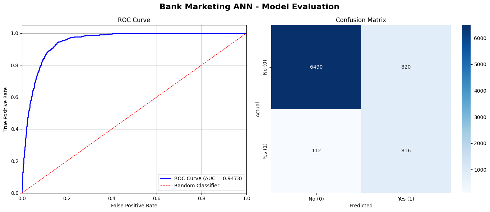

# Bank Marketing Prediction using ANN

## Project Overview
This project aims to predict whether a client will subscribe to a term deposit  
using an Artificial Neural Network (ANN) model.
---
## Dataset
- File: `bank_marketing_full.csv`
- Description: Bank marketing dataset containing client information and campaign results.
---
## Project Workflow
1. Data Preprocessing  
2. Feature Encoding  
3. Handling Class Imbalance  
4. Training ANN Model  
5. Model Evaluation  
---
## Model
- Artificial Neural Network (ANN)
- Saved Model: `bank_marketing_best_model.keras`
---
---
## Model Comparison

| Model | Architecture | Epochs | Accuracy | Precision | Recall | AUC | FP | FN |
|------|-------------|--------|----------|----------|--------|------|----|----|
| Model 1 | 48 → 256 → 128 → 64 → 32 → 1 | 50 | **89.5%** | 0.48 | **0.88** | 0.9454 | 869 | 113 |
| Model 2 | 48 → 64 → 128 → 256 → 128 → 64 → 1 | 100 | 86.9% | **0.52** | 0.82 | 0.9434 | **691** | 171 |
| Model 3 | 48 → 64 → 128 → 256 → 128 → 64 → 1 | 50 | 86.9% | 0.50 | **0.88** | **0.9473** | 820 | **112** |

---

## Model Insights

- **Model 1** achieved the highest **Accuracy**
- **Model 3** achieved the best **AUC** and lowest **False Negatives**
- **Model 2** achieved the best **Precision** and lowest **False Positives**

This shows a trade-off between:
- Precision (reducing false positives)
- Recall (reducing false negatives)

---
## Best Model Selection

The best model was selected based on:
- High Recall (important for detecting positive cases)
- Balanced AUC score

**Selected Model: Model 3**
---
## Model Evaluation

### ROC Curve & Confusion Matrix

- ROC AUC Score ≈ **0.947**
- High classification performance
- Good balance between Precision and Recall
  
---
## Confusion Matrix Insights
- True Negatives: 6490  
- False Positives: 820  
- False Negatives: 112  
- True Positives: 816
---
## Tools & Libraries
- Python  
- TensorFlow / Keras  
- Scikit-learn  
- Pandas  
- NumPy  
- Matplotlib / Seaborn  
---
---
## Team Members
- Mohamed Ahmed Alsayed Hamed (TL)
- Mohamed Ramy Zakaria
- Mostafa Kamel Abu ELezz
  
